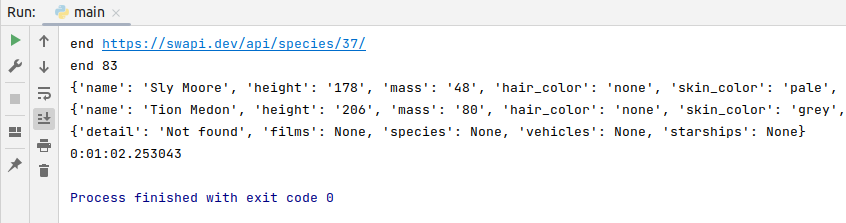
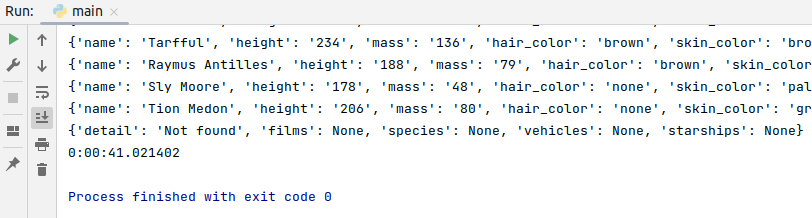
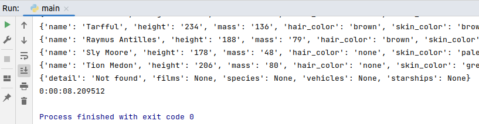

# Ответ:

Для создания БД выполнить в консоли:
```shell
docker-compose up -d
```

В docker-compose также запустит контейнер с PHP клиентом баз данных - "Adminer" 


Он доступен по адресу http://localhost:8081/adminer


Проверила работу скрипта с разным CHUNK_SIZE


CHUNK_SIZE = 3


CHUNK_SIZE = 7


При CHUNK_SIZE = 14


Вывод:
Чем больше параллельных заданий, тем быстрее выполняется скрипт.